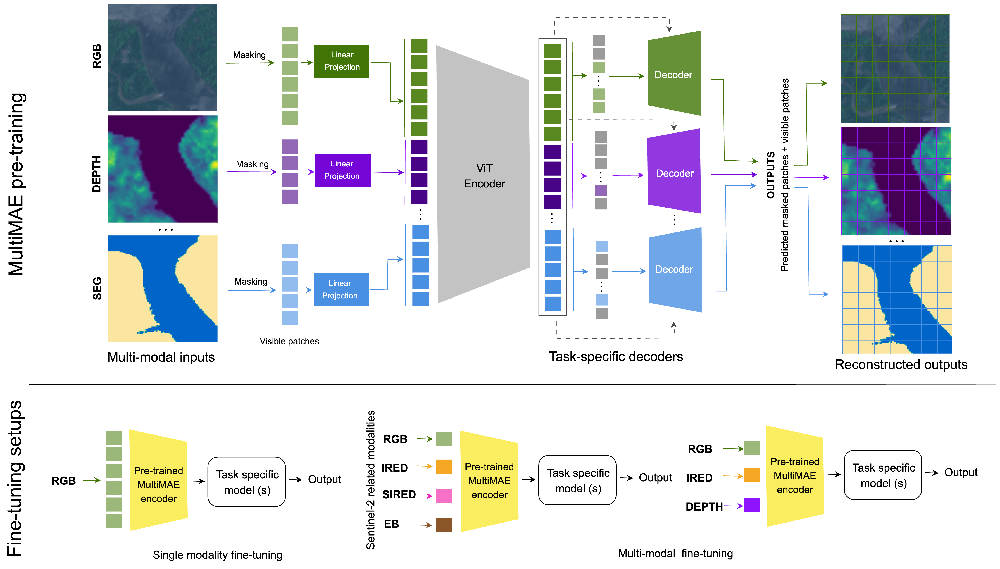

# 🌎🛰️ MultiMAE meets Earth Observation: Pre-training Multi-modal multi-task Masked Autoencoders for Earth Observation tasks


## Updates
- **May 20, 2025:** MultiMAE meets Earth Observation paper is released [[arXiv]]()  [[PDF]]()

## Overview
Multi-modal data in Earth Observation (EO) presents a huge opportunity for improving transfer learning capabilities when pre-training deep learning models. Unlike prior work that often overlooks multi-modal EO data, recent methods have started to include it, resulting in more effective pre-training strategies. However, existing approaches commonly face challenges in effectively transferring learning to downstream tasks where the structure of available data differs from that used during pre-training. This paper addresses this limitation by exploring a more flexible multi-modal, multi-task pre-training strategy for EO data. Specifically, we adopt a Multi-modal Multi-task Masked Autoencoder (MultiMAE) that we pre-train by reconstructing diverse input modalities, including spectral, elevation, and segmentation data. The pre-trained model demonstrates robust transfer learning capabilities, outperforming state-of-the-art methods on various EO datasets for classification and segmentation tasks. Our approach exhibits significant flexibility, handling diverse input configurations without requiring modality-specific pre-trained models.

## Approach



## Pre-training
Code coming soon. Stay tuned ....

## Fine-tuning
Code coming soon. Stay tuned ....


## Acknowledgements
The codebase is inspired from the [MultiMAE](https://github.com/EPFL-VILAB/MultiMAE) repository. Our work uses [MMEarth](https://github.com/vishalned/MMEarth-data) dataset. We thank authors for making their amazing work accesible to the community. 

## Citation
```
@inproceedings{}
```